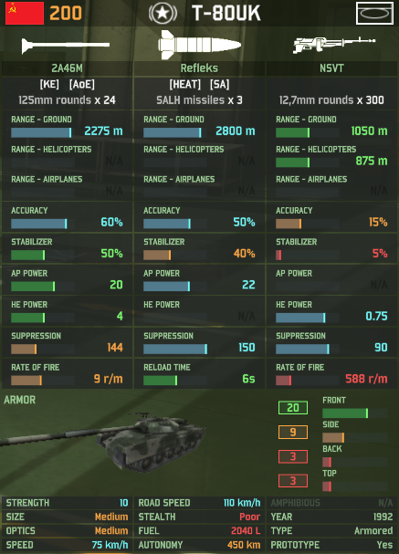

## Introduction

[Wargame: Red Dragon](https://en.wikipedia.org/wiki/Wargame:_Red_Dragon) is a real-time strategy video game which
simulates military encounters between democratic NATO (BLUFOR) and communist PACT (REDFOR) forces during the Cold War
. It is the third game in the series, published by the French company Eugen Entertainment; this particular iteration
is set in Asia, and introduced an Asian setting, Asian coalition members, and naval warfare to the game.

One of the game's draws is its fine-grained level of combat simulation. Players build "decks" composed of unit
"cards" to compete against one another with, and these cards provide a good at-a-glance overview of the complex and
combat simulation level the game's assets operate at:

Although the statistics on these cards are a good first-order approximation, there is a whole second cadre of
gameplay mechanics and characteristics that these cards don't provide information on, as well as a number of
inaccuracies in presentation.

There are hundreds of units like this one, and balancing real time strategy games is hard. I (and others) are interested
in examining interactions between different units in the game. To that effect, this project aims to provide a
reproducible export of the "true" Wargame: Red Dragon (henceforth RD) unit values for the purposes of examination.

## Contents

The `/data` folder contains all of the `CSV` dataset exports. **These are of primary interest**.

The datasets are organized by game version. Each game version corresponds with a patch to the game, and the higher
the patch number the more recent the game version (right up to the current one). A patch log history is [available in
 the forums](http://forums.eugensystems.com/viewtopic.php?f=155&t=57546).

The `/raws` folder contains the corresponding raw XML files, `/scripts` contains the scripts used as part of the
build process (detailed below), and `/figures` and `/notebooks` contain assorted support files.

Each folder contains a `raw_data.csv` file, which contains everything you need. However, note that since this
dataset is an uncompressed word-for-word copy of the game's gut internals, this dataset is *extremely*
verbose. It will only make sense if you have a deep understanding of the game's internals. A data dictionary is
provided in the form of the [Wargame Internal Values Manual](https://github.com/ResidentMario/wargame/blob/master/Wargame_Internal_Values_Manual.pdf).

Work on simplifying the dataset into another, still flatter file is ongoing.

## Build Process
### Overview

RD has an [active modding community](http://forums.eugensystems.com/viewforum.php?f=187) (as did its predecessor in
the series, AirLand Battle). This community has produced a number of tools to aid them in their work.

The most important of these is the [Wargame Modding Suite](http://forums.eugensystems.com/viewtopic.php?t=45922), which
provides a centralized way of accessing, decompiling, and making changes to the game's binary files. This tool has
its own [GitHub repository](https://github.com/enohka/moddingSuite); a (potentially outdated) copy of its
documentation is saved [here](figures\wargame-modding-suite.pdf), for the purposes of posterity.

A second-order tool, built on top of this bedrock one, is the [Data Exporter](http://forums.eugensystems.com/viewtopic.php?f=187&t=57927&sid=3be76da66f1adb0d5a78b97d9f2f0d94).
This tool packages the Modding Suite into a command line tool for extracting specific tables from the game files.

This would be enough in and of itself, but the information we're interested in isn't exposed in top-level tables;
it's instead packed into a descending chain of containers, called "modules".

So to get a good, clean, well-formatted dataset, we need to export all of these tables, remap them to one another
out-of-binary, and then stitch their variables together.

### Step 1: Export the Raw Data

To export the raw data for a version of choice of Wargame: Red Dragon, first download Power Crystal's
[XML Data Exporter](http://forums.eugensystems.com/viewtopic.php?f=187&t=57927&hilit=XML+Exporter). Make sure you
have [Python 3.5](https://www.python.org/downloads/release/python-350/) or later installed, and that the copy of the
Wargame Modding Suite that comes with the data exporter is properly configured.

Either [clone this repository](https://git-scm.com/docs/git-clone) or copy and save
[`dump.py`](https://github.com/ResidentMario/wargame-data/blob/master/scripts/dump.py) somewhere
convenient. Open `Command Prompt` and navigate there. Then, run the following command:

    python export.py UTILITY VERSION OUTPUT

Replace `UTILITY` with the path to your copy of the Data Exporter's `WGTableExporter.exe` (e.g.
`C:/Users/WargamerGuy/Desktop/tableexporter/WGTableExporter.exe`).

Replace `VERSION` with the (numbered) version of the game whose data you want to export (e.g. `510049986`). The list
of all versions of the game you have locally should be located in your Steam files, e.g.
`E:\Steam\steamapps\common\Wargame Red Dragon\Data\WARGAME\PC`). The higher the number, the more recent the version,
right up to the current one.

Replace `OUTPUT` with the path of a folder that you want to write the data to (e.g. to save it to `Desktop` you would
 need something along the lines of `C:\Users\WargamerGuy\Desktop`).

What this will do: if you do all of this successfully, after a minute or two extracting the files you should have a
folder named for the version of the game you exported containing XML and CSV files constituting the game's unit data.

### Step 2: Datasetification

The raw XML output (clumsily) preserves all of the structure of the game's internal data. In order to make that
useful we have to flatten it&mdash;what I am here calling "Datasetification".

To do this you need to run the
[`export.py`](https://github.com/ResidentMario/wargame-data/blob/master/scripts/export.py) script. As before, run:

    python dump.py PATH VERSION OUTPUT

This time replace `PATH` to the folder containing the XML dumps you generated earlier, `VERSION` with the game
version, and `OUTPUT` with, once again, the folder you want to save the result to.

What this will do: after several minutes' processing time the folder you indicated should now contain a `CSV` file, e.g.
`510049986/raw_data.csv`. This file contains the game's unit data, flattened into a convenient format. Rejoice!

### Step 3: Simplification

This still needs to be done.